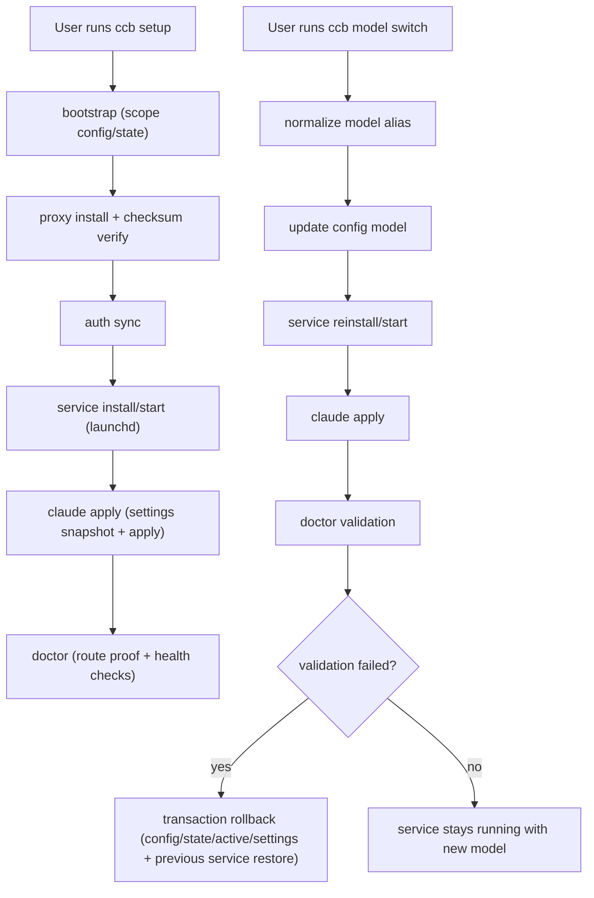

# ccgateway

Go-based macOS CLI for scoped vendor/profile routing with explicit Claude settings apply/revert, transactional rollback, and checksum-verified proxy installs.

## CLI discovery and visibility

### Discover commands quickly

```bash
ccb help
ccb status --vendor codex --profile default
ccb service status --vendor codex --profile default
ccb doctor --vendor codex --profile default
```

### Visibility checks that matter

- `ccb status ...` shows runtime mode/backend/model/port, route proof, tool-call integrity, and local traffic summary.
- `ccb doctor ...` is the authoritative health gate; `[OK]` means current checks pass.
- `Past errors` in `doctor` is history-only. Clear old noise with:

```bash
ccb doctor --vendor codex --profile default --clear-error-history
```

## How it works



## Initial install and setup guide

### 1) Prerequisites

- macOS (darwin `arm64` or `amd64`)
- Claude Code installed
- Codex auth file available at `~/.codex/auth.json` (gateway mode); native cleanup mode does not require auth sync/source

### 2) Install `ccb`

Recommended (agent-safe, deterministic):

```bash
./scripts/install_ccb.sh --source --install-dir "$HOME/.local/bin"
export PATH="$HOME/.local/bin:$PATH"
scripts/verify_ccb.sh --binary "$HOME/.local/bin/ccb"
```

`--source` mode builds from this repository root by default, so it still works when invoked via absolute script path from another working directory.

Or install from GitHub Release:

```bash
./scripts/install_ccb.sh --repo <owner>/<repo> --version latest --install-dir "$HOME/.local/bin"
export PATH="$HOME/.local/bin:$PATH"
scripts/verify_ccb.sh --binary "$HOME/.local/bin/ccb"
```

If you need `/usr/local/bin`:

```bash
sudo ./scripts/install_ccb.sh --repo <owner>/<repo> --version latest --install-dir /usr/local/bin
scripts/verify_ccb.sh --binary /usr/local/bin/ccb
```

### 3) One-shot setup (recommended)

```bash
ccb setup --vendor codex --profile default
ccb setup --vendor codex --profile default --gateway-backend cliproxyapi
ccb setup --vendor codex --profile default --gateway-backend cliproxyapi --settings-layer project
ccb setup --vendor codex --profile default --gateway-backend cliproxyapi --model gpt-5.3-codex-spark
ccb setup --interactive
# experimental (health-oriented) backend; not for full LLM routing
ccb setup --vendor codex --profile default --gateway-backend builtin
```

This runs `bootstrap -> proxy install -> auth sync -> service install/start -> claude apply -> doctor`.
If you only need native cleanup transition:

```bash
ccb setup --vendor codex --profile default --runtime-mode native-cleanup
```

Native cleanup setup also removes existing scope launch agents (`proxy`/`sync`) before applying cleanup settings.
For Codex, model aliases are normalized (`codex` -> `gpt-5.3-codex`, `codex-spark`/`spark` -> `gpt-5.3-codex-spark`).

Direct Claude scope setup (no local proxy route):

```bash
ccb setup --vendor claude --profile default --runtime-mode native-direct --model claude-opus-4-6
```

If you upgraded `ccb` binary, run `ccb service install --vendor codex --profile default` once to regenerate launchd/plist/proxy config before `service start`.

### 4) Bootstrap a scope (manual path)

```bash
ccb bootstrap --vendor codex --profile default
```

Default behavior: `ccb` isolates Claude routing per project by writing to `<cwd>/.claude/settings.json` (`settings_layer=project`), so other local projects/sessions keep their original Claude path.

If an existing scope was created with old user-layer defaults, migrate once:

```bash
ccb bootstrap --vendor codex --profile default --settings-layer project
ccb claude apply --vendor codex --profile default
```

If the same `vendor/profile` is reused from a different project cwd, `setup`/`claude apply`/`use` can now fail with `settings_layer=project mismatch` to prevent cross-project settings writes. Rebind explicitly:

```bash
ccb setup --vendor codex --profile <profile> --settings-layer project
```

### 5) Install runtime dependencies for the scope

`gateway` mode (uses local proxy / CLIProxyAPI):

```bash
ccb proxy install --vendor codex --profile default --version latest
ccb auth sync --vendor codex --profile default
ccb service install --vendor codex --profile default
ccb service start --vendor codex --profile default
ccb service reconcile --vendor codex --profile default
```

`--version` accepts both `vX.Y.Z` and `X.Y.Z` (`latest` also supported).

`native-cleanup` mode (cleanup-only transition path from gateway):

```bash
ccb bootstrap --vendor codex --profile default --runtime-mode native-cleanup
ccb claude apply --vendor codex --profile default
ccb doctor --vendor codex --profile default
```

### 6) Apply Claude settings explicitly

```bash
ccb claude apply --vendor codex --profile default
```

No automatic settings mutation occurs before this command.
In `native-cleanup` mode, `claude apply` removes ccgateway-managed proxy/model override keys from Claude settings.

### 7) Validate health and status

```bash
ccb service status --vendor codex --profile default
ccb doctor --vendor codex --profile default
ccb status --vendor codex --profile default --json
```

### 8) Switch active scope (optional)

```bash
ccb use --vendor codex --profile default
ccb service status --active
ccb doctor --active
```

### 9) Switch model after install (active scope only)

```bash
ccb model switch --vendor codex --profile default --model codex-spark
# equivalent canonical form
ccb model switch --vendor codex --profile default --model gpt-5.3-codex-spark
ccb status --vendor codex --profile default
ccb doctor --vendor codex --profile default
```

`model switch` runs one-shot transition: `config update -> service install/start -> claude apply -> doctor`.
It now enforces active-scope expectation at apply time and verifies active generation at transaction tail to prevent concurrent-switch commit races.
The target scope must be the current active scope, and successful switch keeps the service running.
For `vendor=codex`, Claude selector models (`claude-*`, `opus`, `sonnet`, `haiku`) are rejected by policy.
`model switch` expects proxy artifact already installed for the target scope (`setup` or `proxy install`).

Codex quota/token exhaustion fallback (current supported path):

```bash
# disable gateway routing and clean ccgateway-managed Claude overrides
ccb setup --vendor codex --profile default --runtime-mode native-cleanup
ccb doctor --vendor codex --profile default
```

After native cleanup, select/use Claude-native model (for example `claude-opus-4-6`) directly in Claude Code path.

### 10) Cross-vendor failover (one-shot)

```bash
ccb preflight --from codex:default --to claude:default --model claude-opus-4-6
ccb failover --from codex:default --to claude:default --model claude-opus-4-6
```

`failover` applies a transactional scope switch: target bootstrap/update (uses target scope runtime mode) -> target runtime prep (gateway only) -> active switch -> doctor validation -> rollback on failure.
For existing target scopes, settings binding/policy validation now runs before mutation; if binding is mismatched, failover is blocked without changing target config/state.
`failover` switch stage also validates the source active snapshot at switch time; if source active changed concurrently, failover aborts and rolls back without clobbering external active changes.

### 11) Context-gap preflight and handoff bundle

`preflight` is a failover gate that distinguishes:

- blocking checks (must pass before failover)
- warnings (advisory signals like route/tool integrity)

```bash
ccb preflight --from codex:default --to claude:default --model claude-opus-4-6
ccb preflight --from codex:default --to claude:default --model claude-opus-4-6 --json
```

For multi-agent/operator handoff, generate a ready-to-run bundle:

```bash
ccb handoff create --from codex:default --to claude:default --model claude-opus-4-6 --output /tmp/ccb-handoff.md
```

`handoff create` does not mutate scopes/services. It packages preflight checks and next commands (`preflight -> failover -> doctor`) into markdown or JSON.

### 12) Revert and uninstall (optional)

```bash
ccb claude revert --vendor codex --profile default
ccb uninstall --vendor codex --profile default
# full cleanup
ccb uninstall --vendor codex --profile default --purge
```

## Command reference

All mutating commands require explicit scope:

```bash
ccb bootstrap --vendor codex --profile default
ccb setup --vendor codex --profile default
ccb setup --vendor codex --profile default --settings-layer project
ccb proxy install --vendor codex --profile default --version latest
ccb auth sync --vendor codex --profile default
ccb service install --vendor codex --profile default
ccb service start --vendor codex --profile default
ccb service reconcile --vendor codex --profile default
ccb service stop --vendor codex --profile default
ccb claude apply --vendor codex --profile default
ccb claude revert --vendor codex --profile default
ccb model switch --vendor codex --profile default --model codex-spark
ccb failover --from codex:default --to claude:default --model claude-opus-4-6
ccb use --vendor codex --profile default
ccb uninstall --vendor codex --profile default
ccb uninstall --vendor codex --profile default --purge
```

Read-only commands can target explicit scope or active scope:

```bash
ccb status --vendor codex --profile default
ccb status --active
ccb status --vendor codex --profile default --json
ccb service status --vendor codex --profile default
ccb service status --active
ccb doctor --vendor codex --profile default
ccb doctor --active
ccb doctor --vendor codex --profile default --verbose
ccb preflight --from codex:default --to claude:default --model claude-opus-4-6
ccb preflight --from codex:default --to claude:default --model claude-opus-4-6 --json
ccb handoff create --from codex:default --to claude:default --model claude-opus-4-6 --output /tmp/ccb-handoff.md
```

Backend runtime entrypoint (no scope flags, used by builtin wrapper):

```bash
ccb gateway serve --config <path>
```

## Design guarantees

- SHA256 hard verification using release `checksums.txt` (`ERR_CHECKSUM_MISMATCH` on mismatch)
- Transactional install/apply/model-switch flows with rollback compensation
- Explicit `launchctl` failures surfaced with error codes (no silent warnings)
- Runtime mode isolation: `proxy/service` commands require `runtime_mode=gateway`; `runtime_mode=native-cleanup` is cleanup-only; `runtime_mode=native-direct` is direct vendor path without local proxy routing
- Codex model aliases are normalized at input (`codex`/`codex-spark`/`spark`), Codex scopes reject Claude selector models as upstream targets, and proxy alias mapping keeps Claude-style selectors routed to the configured Codex model
- Snapshot+hash-based Claude settings restore; repeated apply/use keeps the original verified baseline so `claude revert` restores true pre-apply settings
- `model switch` is active-scope-only and includes active-generation tail verification; rollback avoids clobbering unrelated concurrent active-pointer changes
- `failover` performs cross-scope switch transaction with rollback (`from` active validation, target runtime-aware switch, doctor gate) and enforces source-active snapshot consistency at switch time
- Unsafe cross-scope restore is blocked by active-generation checks in `claude revert`/`uninstall`
- `doctor` provides `route proof`; `Past errors` is history-only and can be cleared with `--clear-error-history`

## Filesystem layout

Base directory: `~/.ccgateway`

Global:

- `global/active.json`
- `global/locks/switch.lock`
- `global/ports.json`

Per scope:

- `vendors/<vendor>/profiles/<profile>/config.yaml`
- `vendors/<vendor>/profiles/<profile>/state.json`
- `vendors/<vendor>/profiles/<profile>/auth/`
- `vendors/<vendor>/profiles/<profile>/logs/app.log`
- `vendors/<vendor>/profiles/<profile>/proxy/`
- `vendors/<vendor>/profiles/<profile>/launchd/`
- `vendors/<vendor>/profiles/<profile>/snapshots/`

## Config schema

`config.yaml`:

```yaml
schema_version: 2
vendor_id: "codex"
profile_id: "default"
runtime_mode: "gateway"
port: 8317
model: "gpt-5.3-codex"
auth_mode: "oauth_file"
proxy_enabled: true
proxy_version: "latest"
gateway_backend: "cliproxyapi"
auth_source: "~/.codex/auth.json"
auth_target: "~/.ccgateway/vendors/codex/profiles/default/auth/codex-from-codex-cli.json"
settings_layer: "project"
settings_path: "/path/to/project/.claude/settings.json"
```

## CI and release

- CI: `.github/workflows/ci.yml` (`go vet`, `go test`, `go test -race`)
- Release: `.github/workflows/release.yml` (darwin `amd64/arm64` binaries + `checksums.txt` upload)

## Build and test

```bash
go build -o ccb ./cmd/ccb
go vet ./...
go test ./...
go test -race ./...
```

## Troubleshooting

### `unknown provider for model claude-opus-4-6`

This indicates proxy alias config is stale. Regenerate scope service/config:

```bash
ccb service install --vendor codex --profile default
ccb service start --vendor codex --profile default
ccb doctor --vendor codex --profile default
```

Restarting Claude Code alone does not fix this.

### `invalid model for vendor=codex` / Claude selector rejected in `model switch` or `setup`

`vendor=codex` gateway scopes accept Codex upstream models only. Claude selector inputs (`claude-*`, `opus`, `sonnet`, `haiku`) are blocked.

Use one of:

```bash
# stay on codex gateway
ccb model switch --vendor codex --profile default --model gpt-5.3-codex
ccb model switch --vendor codex --profile default --model gpt-5.3-codex-spark
```

```bash
# fallback away from codex gateway (token/quota exhausted path)
ccb setup --vendor codex --profile default --runtime-mode native-cleanup
ccb doctor --vendor codex --profile default
```

### `model switch` fails with `proxy binary missing`

This scope was only bootstrapped (or proxy artifact was removed), so there is no local proxy binary to re-render/restart service.

```bash
ccb setup --vendor codex --profile <profile> --gateway-backend cliproxyapi --model gpt-5.3-codex
# or minimal recovery
ccb proxy install --vendor codex --profile <profile>
```

### `setup` fails at service start (`ERR_SWITCH_VALIDATION_FAILED`, `connect: connection refused`)

`setup` already retries once automatically (`service install -> service start`) for known signatures. If it still fails, run:

```bash
ccb service install --vendor codex --profile default
ccb service start --vendor codex --profile default
ccb doctor --vendor codex --profile default
```

### `service install` fails midway and launchd state looks inconsistent

From `v0.2.4`, failed `service install` now performs internal cleanup (both labels bootout + plist removal) before returning error.
Retry with the standard chain (manual `launchctl load` should not be required):

```bash
ccb service install --vendor codex --profile default
ccb service start --vendor codex --profile default
ccb doctor --vendor codex --profile default
```

### `ERR_POLICY_VIOLATION` appears

Strict codex policy guard blocked the command. Typical fix is to keep settings scoped per project:

```bash
ccb setup --vendor codex --profile default --settings-layer project
```

### `ERR_LAUNCHCTL_FAILED` with `Could not find service ... sync`

`setup` already retries once automatically for this signature. If it still fails, re-run service install first:

```bash
ccb service install --vendor codex --profile default
ccb service start --vendor codex --profile default
```

### Tool calls fail with missing required parameters (`input: {}` in proxy transcripts)

If logs repeatedly show errors like `The required parameter 'query|pattern|command' is missing` with `input: {}`, treat this as malformed tool-call traffic.

Run:

```bash
ccb auth sync --vendor codex --profile default
ccb service install --vendor codex --profile default
ccb service start --vendor codex --profile default
ccb model switch --vendor codex --profile default --model gpt-5.3-codex
ccb doctor --vendor codex --profile default
```

`doctor` now includes a `tool-call integrity` check and reports this pattern directly.

### `doctor` shows old errors in `Past errors`

That section is history-only and does not mean current checks failed. To clear history:

```bash
ccb doctor --vendor codex --profile default --clear-error-history
```

Example: old `ERR_INVALID_ARGS` entries from earlier unsupported/incorrect status usages
(`status --since 24h`, `ccb-status --since 24h`) can still appear in history even when
current checks are all `[OK]`.

### `claude revert` fails or user-level settings got tangled

If global `~/.claude/settings.json` was previously used and scopes became tangled, recover in this order:

```bash
# 1) backup + scrub ccgateway-managed keys from user settings
python3 - <<'PY'
import json, os, shutil, time
p=os.path.expanduser("~/.claude/settings.json")
os.makedirs(os.path.dirname(p), exist_ok=True)
if not os.path.exists(p):
    open(p, "w").write("{}\n")
bak=p+f".bak.ccb-recovery.{int(time.time())}"
shutil.copy2(p, bak)
d=json.load(open(p))
if not isinstance(d, dict):
    d={}
env=d.get("env") if isinstance(d.get("env"), dict) else {}
for k in [
  "ANTHROPIC_BASE_URL","ANTHROPIC_AUTH_TOKEN","ANTHROPIC_MODEL",
  "ANTHROPIC_SMALL_FAST_MODEL","ANTHROPIC_DEFAULT_SONNET_MODEL",
  "ANTHROPIC_DEFAULT_OPUS_MODEL","ANTHROPIC_DEFAULT_HAIKU_MODEL"
]:
    env.pop(k, None)
d.pop("model", None)
if env: d["env"]=env
elif "env" in d: d.pop("env", None)
with open(p, "w") as f:
    json.dump(d, f, indent=2); f.write("\n")
os.chmod(p, 0o600)
print("backup:", bak)
print("cleaned:", p)
PY
```

```bash
# 2) rebind each scope to project-local settings
ccb setup --vendor codex --profile default --settings-layer project
# example for another project profile
ccb setup --vendor codex --profile <profile> --settings-layer project
```

```bash
# 3) if revert metadata is stale, clear scope Claude state (last resort)
python3 - <<'PY'
import json, glob, os
for sp in glob.glob(os.path.expanduser("~/.ccgateway/vendors/*/profiles/*/state.json")):
    st=json.load(open(sp))
    c=st.setdefault("claude", {})
    c["applied"]=False
    c["snapshot_path"]=""
    c["snapshot_sha256"]=""
    c["applied_generation"]=""
    with open(sp, "w") as f:
        json.dump(st, f, indent=2); f.write("\n")
    print("state-reset:", sp)
PY
```

After recovery, apply only in the target project cwd:

```bash
ccb claude apply --vendor codex --profile <profile>
ccb doctor --vendor codex --profile <profile>
```

## License

MIT

## Changelog

See `CHANGELOG.md`
