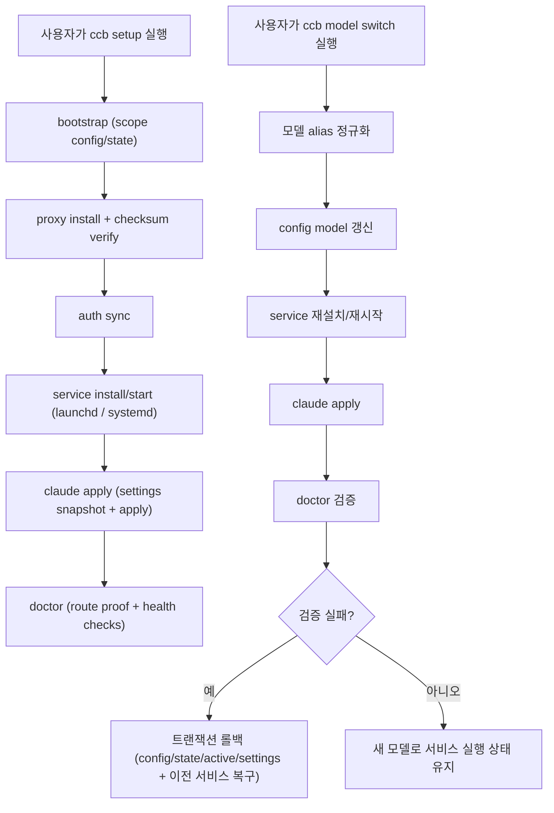

# ccgateway

벤더/프로필 스코프 라우팅, 명시적 Claude 설정 apply/revert, 트랜잭션 롤백, 체크섬 검증 기반 프록시 설치를 제공하는 Go CLI(macOS / Linux)입니다.

## CLI 디스커버리 및 가시성

### 명령 빠르게 찾기

```bash
ccb help
ccb status --vendor codex --profile default
ccb service status --vendor codex --profile default
ccb doctor --vendor codex --profile default
```

### 운영 가시성 핵심 포인트

- `ccb status ...`는 runtime mode/backend/model/port, route proof, tool-call integrity, 로컬 트래픽 요약을 보여줍니다.
- `ccb doctor ...`가 현재 상태의 기준 점검입니다. `[OK]`면 현재 체크는 정상입니다.
- `doctor`의 `Past errors`는 이력 전용입니다. 오래된 이력을 지우려면:

```bash
ccb doctor --vendor codex --profile default --clear-error-history
```

## 동작 방식



## 초기 설치 및 설정 가이드

### 1) 사전 요구사항

- **macOS** (`darwin arm64` 또는 `darwin amd64`) **또는 Linux** (`amd64` 또는 `arm64`)
- Claude Code 설치
- Codex 인증 파일 `~/.codex/auth.json` 준비(gateway 모드)
  (native cleanup 모드는 auth sync/source가 필수가 아니며, 커스텀 경로는 `--auth-source`로 지정 가능)

**Linux 전용 사전 요구사항:**

- `systemd` (사용자 세션 지원 필수)
- `loginctl enable-linger <user>` — 활성 로그인 세션 없이도 사용자 서비스 실행 가능
- `XDG_RUNTIME_DIR` 설정 (일반적으로 `/run/user/$(id -u)`; 대부분의 systemd 배포판에서 자동 설정)

### 2) `ccb` 설치

권장 방식(에이전트/반복 실행 안전):

```bash
./scripts/install_ccb.sh --source --install-dir "$HOME/.local/bin"
export PATH="$HOME/.local/bin:$PATH"
scripts/verify_ccb.sh --binary "$HOME/.local/bin/ccb"
```

`--source` 모드는 기본적으로 이 레포 루트에서 빌드하므로, 다른 작업 디렉터리에서 스크립트를 절대 경로로 호출해도 동작합니다.

GitHub Release에서 설치:

```bash
./scripts/install_ccb.sh --repo <owner>/<repo> --version latest --install-dir "$HOME/.local/bin"
export PATH="$HOME/.local/bin:$PATH"
scripts/verify_ccb.sh --binary "$HOME/.local/bin/ccb"
```

`/usr/local/bin`에 설치해야 한다면:

```bash
sudo ./scripts/install_ccb.sh --repo <owner>/<repo> --version latest --install-dir /usr/local/bin
scripts/verify_ccb.sh --binary /usr/local/bin/ccb
```

### 3) 원샷 설치(권장)

```bash
ccb setup --vendor codex --profile default
ccb setup --vendor codex --profile default --gateway-backend cliproxyapi
ccb setup --vendor codex --profile default --gateway-backend cliproxyapi --settings-layer project
ccb setup --vendor codex --profile default --gateway-backend cliproxyapi --model gpt-5.3-codex-spark
ccb setup --interactive
# 실험용(헬스 중심) 백엔드이며 전체 LLM 라우팅 용도는 아님
ccb setup --vendor codex --profile default --gateway-backend builtin
```

다음 단계를 한 번에 수행합니다: `bootstrap -> proxy install -> auth sync -> service install/start -> claude apply -> doctor`.
native cleanup 전환만 필요하면:

```bash
ccb setup --vendor codex --profile default --runtime-mode native-cleanup
```

native cleanup setup은 Claude cleanup 적용 전에 기존 scope의 서비스 에이전트(macOS: launchd, Linux: systemd)(`proxy`/`sync`)도 함께 정리합니다.
Codex에서는 모델 별칭이 canonical ID로 정규화됩니다 (`codex` -> `gpt-5.3-codex`, `codex-spark`/`spark` -> `gpt-5.3-codex-spark`).

Claude direct 스코프를 바로 구성하려면:

```bash
ccb setup --vendor claude --profile default --runtime-mode native-direct --model claude-sonnet-4-6
# 또는 최고 지능 모델
ccb setup --vendor claude --profile default --runtime-mode native-direct --model claude-opus-4-6
```

`ccb` 바이너리를 업데이트했다면, `service start` 전에 `ccb service install --vendor codex --profile default`를 1회 실행해 서비스 설정(macOS: launchd plist, Linux: systemd unit)을 재생성하세요.

### 4) 스코프 초기화 (수동 경로)

```bash
ccb bootstrap --vendor codex --profile default
```

기본 동작: Claude 라우팅 설정은 프로젝트 단위로 격리되며 `<cwd>/.claude/settings.json` (`settings_layer=project`)에 기록됩니다. 따라서 다른 로컬 프로젝트/세션은 기존 Claude 경로를 유지합니다.

기존 스코프가 구버전 기본값(`settings_layer=user`)으로 생성되었다면 1회 마이그레이션:

```bash
ccb bootstrap --vendor codex --profile default --settings-layer project
ccb claude apply --vendor codex --profile default
```

동일한 `vendor/profile`을 다른 프로젝트 cwd에서 재사용하면, 교차 프로젝트 설정 쓰기를 막기 위해 `settings_layer=project mismatch`로 `setup`/`claude apply`/`use`가 실패할 수 있습니다. 다음으로 명시 재바인딩하세요:

```bash
ccb setup --vendor codex --profile <profile> --settings-layer project
```

### 5) 스코프 런타임 구성 설치

`gateway` 모드(로컬 프록시 / CLIProxyAPI 사용):

```bash
ccb proxy install --vendor codex --profile default --version latest
ccb auth sync --vendor codex --profile default
ccb service install --vendor codex --profile default
ccb service start --vendor codex --profile default
ccb service reconcile --vendor codex --profile default
```

`--version`은 `vX.Y.Z`와 `X.Y.Z`를 모두 허용합니다 (`latest`도 지원).

`native-cleanup` 모드(gateway -> native 전환용 cleanup 전용 경로):

```bash
ccb bootstrap --vendor codex --profile default --runtime-mode native-cleanup
ccb claude apply --vendor codex --profile default
ccb doctor --vendor codex --profile default
```

### 6) Claude 설정 명시 적용

```bash
ccb claude apply --vendor codex --profile default
```

`claude apply` 전에는 Claude 설정을 자동으로 변경하지 않습니다.
`native-cleanup` 모드에서는 `claude apply` 시 ccgateway가 관리하던 프록시/모델 오버라이드 키를 제거합니다.

### 7) 상태/헬스 검증

```bash
ccb service status --vendor codex --profile default
ccb doctor --vendor codex --profile default
ccb status --vendor codex --profile default --json
```

### 8) active 스코프 전환 (선택)

```bash
ccb use --vendor codex --profile default
ccb service status --active
ccb doctor --active
```

### 9) 설치 후 모델 전환 (active 스코프 전용)

```bash
ccb model switch --vendor codex --profile default --model codex-spark
# canonical 모델명으로 동일 동작
ccb model switch --vendor codex --profile default --model gpt-5.3-codex-spark
ccb status --vendor codex --profile default
ccb doctor --vendor codex --profile default
```

`model switch`는 `config 갱신 -> service install/start -> claude apply -> doctor`를 원샷으로 수행합니다.
대상 스코프는 현재 active 스코프여야 하며, 성공 시 서비스는 실행 상태로 유지됩니다.
`claude apply` 단계에서 active 스코프 기대값을 재검증하고, 트랜잭션 종료 시 active generation tail 검증을 수행해 동시 전환 경쟁 커밋을 차단합니다.
`vendor=codex`에서는 Claude selector 모델(`claude-*`, `opus`, `sonnet`, `haiku`) 입력이 정책상 거부됩니다.
`model switch`는 대상 스코프에 프록시 아티팩트가 이미 설치되어 있어야 합니다 (`setup` 또는 `proxy install` 완료 상태).

Codex 토큰/쿼터 소진 시 현재 지원되는 전환 경로:

```bash
# gateway 라우팅 해제 + ccgateway가 주입한 Claude override 정리
ccb setup --vendor codex --profile default --runtime-mode native-cleanup
ccb doctor --vendor codex --profile default
```

native cleanup 이후에는 Claude Code native 경로에서 `claude-sonnet-4-6` 또는 `claude-opus-4-6` 같은 Claude 모델을 직접 선택해 사용합니다.

### 10) 크로스 벤더 failover (원샷)

```bash
ccb preflight --from codex:default --to claude:default --model claude-sonnet-4-6
ccb failover --from codex:default --to claude:default --model claude-sonnet-4-6
# 또는 --model claude-opus-4-6 (최고 지능 모델)
```

`failover`는 트랜잭션 전환으로 동작합니다: target 스코프 bootstrap/update(해당 스코프 runtime mode 사용) -> target runtime 준비(gateway일 때만) -> active 전환 -> doctor 검증 -> 실패 시 롤백.
기존 target 스코프에 대해서는 설정 바인딩/정책 검증을 변경 전에 먼저 수행하므로, 바인딩 불일치 시 target config/state를 바꾸지 않고 즉시 차단됩니다.
또한 전환 시점에 source active 스냅샷 일치 여부를 다시 검증하여, 동시성으로 source active가 바뀌면 failover를 중단하고 외부 active 변경을 덮어쓰지 않도록 롤백합니다.

### 11) 컨텍스트 차이 완화용 preflight/handoff

`preflight`는 failover 전 점검 게이트입니다.

- blocking check: failover 전에 반드시 해결해야 하는 항목
- warning: 참고 신호(예: route/tool integrity)

```bash
ccb preflight --from codex:default --to claude:default --model claude-sonnet-4-6
ccb preflight --from codex:default --to claude:default --model claude-sonnet-4-6 --json
```

멀티 에이전트/운영자 인수인계를 위해 실행 번들을 만들 수 있습니다.

```bash
ccb handoff create --from codex:default --to claude:default --model claude-sonnet-4-6 --output /tmp/ccb-handoff.md
```

`handoff create`는 scope/service를 변경하지 않고, `preflight -> failover -> doctor` 실행 순서를 markdown/JSON으로 정리합니다.

### 12) 복원 및 제거 (선택)

```bash
ccb claude revert --vendor codex --profile default
ccb uninstall --vendor codex --profile default
# 전체 정리
ccb uninstall --vendor codex --profile default --purge
```

## 명령 참조

상태를 변경하는 명령은 스코프를 반드시 명시해야 합니다.

```bash
ccb bootstrap --vendor codex --profile default
ccb setup --vendor codex --profile default
ccb setup --vendor codex --profile default --settings-layer project
ccb proxy install --vendor codex --profile default --version latest
ccb auth sync --vendor codex --profile default
ccb service install --vendor codex --profile default
ccb service start --vendor codex --profile default
ccb service reconcile --vendor codex --profile default
ccb service stop --vendor codex --profile default
ccb claude apply --vendor codex --profile default
ccb claude revert --vendor codex --profile default
ccb model switch --vendor codex --profile default --model codex-spark
ccb failover --from codex:default --to claude:default --model claude-sonnet-4-6
ccb use --vendor codex --profile default
ccb uninstall --vendor codex --profile default
ccb uninstall --vendor codex --profile default --purge
```

조회 명령은 명시 스코프 또는 활성 스코프(`--active`)를 사용할 수 있습니다.

```bash
ccb status --vendor codex --profile default
ccb status --active
ccb status --vendor codex --profile default --json
ccb service status --vendor codex --profile default
ccb service status --active
ccb doctor --vendor codex --profile default
ccb doctor --active
ccb doctor --vendor codex --profile default --verbose
ccb preflight --from codex:default --to claude:default --model claude-sonnet-4-6
ccb preflight --from codex:default --to claude:default --model claude-sonnet-4-6 --json
ccb handoff create --from codex:default --to claude:default --model claude-sonnet-4-6 --output /tmp/ccb-handoff.md
```

백엔드 런타임 엔트리포인트(스코프 플래그 없음, builtin 래퍼가 사용):

```bash
ccb gateway serve --config <path>
```

## 설계 보장

- 릴리스 `checksums.txt` 기반 SHA256 강제 검증 (`ERR_CHECKSUM_MISMATCH`)
- 설치/적용/모델 전환 단계의 트랜잭션 실행 및 보상 롤백
- 서비스 매니저 실패(macOS: `launchctl`, Linux: `systemctl --user`)를 경고로 숨기지 않고 에러 코드로 명시 반환
- 런타임 모드 분리: `proxy/service` 명령은 `runtime_mode=gateway`에서만 허용, `runtime_mode=native-cleanup`은 cleanup 전용, `runtime_mode=native-direct`는 로컬 프록시 없는 direct 벤더 경로
- Codex 모델 입력 별칭(`codex`/`codex-spark`/`spark`)은 canonical ID로 정규화되며, Codex 스코프에서 Claude selector 모델은 upstream 대상으로 거부되고, 프록시 alias 매핑으로 Claude 스타일 selector는 구성된 Codex 모델로 라우팅됨
- 스냅샷+해시 검증 기반 Claude 설정 복원, 반복 적용(`apply`/`use`)에서도 최초 검증 기준점을 유지해 `claude revert` 시 원본 복원 보장
- `model switch`는 active 스코프에서만 허용되며 active-generation tail 검증을 포함하고, 롤백 시 외부 동시 active 변경을 불필요하게 덮어쓰지 않음
- `failover`는 cross-scope 전환 트랜잭션으로 동작하며 (`from` active 검증, target runtime-aware 전환, doctor gate), 전환 시점 source active 스냅샷 일치 검증을 강제함
- `claude revert`/`uninstall`에서 active generation 검증으로 교차 스코프 복원 위험 차단
- `doctor`는 `route proof`를 제공하며, `Past errors`는 이력 정보로 분리되고 `--clear-error-history`로 초기화 가능

## 파일 시스템 레이아웃

기본 경로: `~/.ccgateway`

전역:

- `global/active.json`
- `global/locks/switch.lock`
- `global/ports.json`

스코프 전용:

- `vendors/<vendor>/profiles/<profile>/config.yaml`
- `vendors/<vendor>/profiles/<profile>/state.json`
- `vendors/<vendor>/profiles/<profile>/auth/`
- `vendors/<vendor>/profiles/<profile>/logs/app.log`
- `vendors/<vendor>/profiles/<profile>/proxy/`
- `vendors/<vendor>/profiles/<profile>/launchd/` (macOS) 또는 `vendors/<vendor>/profiles/<profile>/systemd/` (Linux)
- `vendors/<vendor>/profiles/<profile>/snapshots/`

## 설정 스키마

`config.yaml`:

```yaml
schema_version: 2
vendor_id: "codex"
profile_id: "default"
runtime_mode: "gateway"
port: 8317
model: "gpt-5.3-codex"
auth_mode: "oauth_file"
proxy_enabled: true
proxy_version: "latest"
gateway_backend: "cliproxyapi"
auth_source: "~/.codex/auth.json"
auth_target: "~/.ccgateway/vendors/codex/profiles/default/auth/codex-from-codex-cli.json"
settings_layer: "project"
settings_path: "/path/to/project/.claude/settings.json"
```

## CI 및 릴리스

- CI: `.github/workflows/ci.yml` (`go vet`, `go test`, `go test -race`)
- 릴리스: `.github/workflows/release.yml` (darwin `amd64/arm64` + linux `amd64/arm64` 바이너리 + `checksums.txt` 업로드)

## 빌드 및 테스트

```bash
go build -o ccb ./cmd/ccb
go vet ./...
go test ./...
go test -race ./...
```

## 트러블슈팅

### `unknown provider for model claude-opus-4-6` (또는 `claude-sonnet-4-6`)

프록시 alias 설정이 오래된 상태일 때 발생합니다. 스코프 서비스/설정을 재생성하세요.

```bash
ccb service install --vendor codex --profile default
ccb service start --vendor codex --profile default
ccb doctor --vendor codex --profile default
```

이 경우 Claude Code 재시작만으로는 해결되지 않습니다.

### `invalid model for vendor=codex` / `model switch` 또는 `setup`에서 Claude selector 거부

`vendor=codex` gateway 스코프는 Codex upstream 모델만 허용합니다. Claude selector 입력(`claude-*`, `opus`, `sonnet`, `haiku`)은 정책상 차단됩니다.

다음 중 하나를 사용하세요.

```bash
# codex gateway 유지
ccb model switch --vendor codex --profile default --model gpt-5.3-codex
ccb model switch --vendor codex --profile default --model gpt-5.3-codex-spark
```

```bash
# codex gateway에서 이탈(토큰/쿼터 소진 fallback 경로)
ccb setup --vendor codex --profile default --runtime-mode native-cleanup
ccb doctor --vendor codex --profile default
```

### `model switch`에서 `proxy binary missing` 발생

해당 스코프가 bootstrap만 된 상태이거나 프록시 아티팩트가 삭제된 상태입니다. 서비스 재생성을 위한 로컬 프록시 바이너리가 없습니다.

```bash
ccb setup --vendor codex --profile <profile> --gateway-backend cliproxyapi --model gpt-5.3-codex
# 최소 복구
ccb proxy install --vendor codex --profile <profile>
```

### `setup` 중 service start 실패 (`ERR_SWITCH_VALIDATION_FAILED`, `connect: connection refused`)

해당 시그니처는 `setup`에서 이미 1회 자동 재시도(`service install -> service start`)합니다. 그래도 실패하면 아래를 실행하세요.

```bash
ccb service install --vendor codex --profile default
ccb service start --vendor codex --profile default
ccb doctor --vendor codex --profile default
```

### `service install` 중간 실패 후 서비스 매니저 상태가 꼬여 보이는 경우

**macOS:** `v0.2.4`부터는 `service install` 실패 시 내부적으로 정리(두 label bootout + plist 제거)를 수행한 뒤 에러를 반환합니다.
수동 `launchctl load` 대신 표준 복구 체인을 다시 실행하세요.

```bash
ccb service install --vendor codex --profile default
ccb service start --vendor codex --profile default
ccb doctor --vendor codex --profile default
```

**Linux:** `service install` 중간 실패 시 stale systemd unit이 남을 수 있습니다. 표준 복구 체인으로 정리됩니다:

```bash
ccb service install --vendor codex --profile default
ccb service start --vendor codex --profile default
ccb doctor --vendor codex --profile default
```

unit이 계속 stuck 상태라면 수동 리셋 후 재시도하세요:

```bash
systemctl --user stop ccgateway-codex-default-proxy.service 2>/dev/null
systemctl --user disable ccgateway-codex-default-proxy.service 2>/dev/null
systemctl --user daemon-reload
ccb service install --vendor codex --profile default
ccb service start --vendor codex --profile default
```

### `ERR_POLICY_VIOLATION` 발생

codex strict 정책 가드가 명령을 차단한 상태입니다. 기본 복구는 프로젝트 격리 설정 유지입니다.

```bash
ccb setup --vendor codex --profile default --settings-layer project
```

### macOS: `ERR_LAUNCHCTL_FAILED` + `Could not find service ... sync`

해당 시그니처도 `setup`에서 1회 자동 재시도합니다. 그래도 실패하면 먼저 service install을 다시 실행하세요.

```bash
ccb service install --vendor codex --profile default
ccb service start --vendor codex --profile default
```

### Linux: `ERR_SYSTEMD_FAILED` + `Unit not found` 또는 `Failed to start`

user linger가 활성화되어 있고 systemd 사용자 세션이 사용 가능한지 확인하세요:

```bash
loginctl enable-linger "$(whoami)"
export XDG_RUNTIME_DIR="/run/user/$(id -u)"
ccb service install --vendor codex --profile default
ccb service start --vendor codex --profile default
ccb doctor --vendor codex --profile default
```

### tool 파라미터 누락 반복 (`input: {}` + required parameter missing)

로그에 `The required parameter 'query|pattern|command' is missing`와 `input: {}`가 반복되면 malformed tool-call 트래픽으로 보고 복구하세요.

```bash
ccb auth sync --vendor codex --profile default
ccb service install --vendor codex --profile default
ccb service start --vendor codex --profile default
ccb model switch --vendor codex --profile default --model gpt-5.3-codex
ccb doctor --vendor codex --profile default
```

이 패턴은 `doctor`의 `tool-call integrity` 체크로도 바로 확인할 수 있습니다.

### `doctor`의 `Past errors`에 과거 오류가 보이는 경우

해당 섹션은 현재 실패가 아닌 이력 정보입니다. 이력을 지우려면:

```bash
ccb doctor --vendor codex --profile default --clear-error-history
```

예시: 과거의 잘못된/미지원 status 사용(`status --since 24h`, `ccb-status --since 24h`)으로
기록된 `ERR_INVALID_ARGS`가 남아 있어도, 현재 체크가 모두 `[OK]`라면 현재 상태는 정상입니다.

### `claude revert` 실패 또는 user 전역 설정 꼬임 복구

과거에 전역 `~/.claude/settings.json`을 공유해 사용했다면, 아래 순서로 복구하세요.

```bash
# 1) user 설정 백업 + ccgateway 관리 키 제거
python3 - <<'PY'
import json, os, shutil, time
p=os.path.expanduser("~/.claude/settings.json")
os.makedirs(os.path.dirname(p), exist_ok=True)
if not os.path.exists(p):
    open(p, "w").write("{}\n")
bak=p+f".bak.ccb-recovery.{int(time.time())}"
shutil.copy2(p, bak)
d=json.load(open(p))
if not isinstance(d, dict):
    d={}
env=d.get("env") if isinstance(d.get("env"), dict) else {}
for k in [
  "ANTHROPIC_BASE_URL","ANTHROPIC_AUTH_TOKEN","ANTHROPIC_MODEL",
  "ANTHROPIC_SMALL_FAST_MODEL","ANTHROPIC_DEFAULT_SONNET_MODEL",
  "ANTHROPIC_DEFAULT_OPUS_MODEL","ANTHROPIC_DEFAULT_HAIKU_MODEL"
]:
    env.pop(k, None)
d.pop("model", None)
if env: d["env"]=env
elif "env" in d: d.pop("env", None)
with open(p, "w") as f:
    json.dump(d, f, indent=2); f.write("\n")
os.chmod(p, 0o600)
print("backup:", bak)
print("cleaned:", p)
PY
```

```bash
# 2) 각 스코프를 프로젝트 로컬 설정으로 재바인딩
ccb setup --vendor codex --profile default --settings-layer project
# 다른 프로젝트 프로필 예시
ccb setup --vendor codex --profile <profile> --settings-layer project
```

```bash
# 3) revert 메타데이터가 꼬인 경우(최후 수단) 스코프 Claude state 초기화
python3 - <<'PY'
import json, glob, os
for sp in glob.glob(os.path.expanduser("~/.ccgateway/vendors/*/profiles/*/state.json")):
    st=json.load(open(sp))
    c=st.setdefault("claude", {})
    c["applied"]=False
    c["snapshot_path"]=""
    c["snapshot_sha256"]=""
    c["applied_generation"]=""
    with open(sp, "w") as f:
        json.dump(st, f, indent=2); f.write("\n")
    print("state-reset:", sp)
PY
```

복구 후에는 대상 프로젝트 cwd에서만 다시 적용하세요.

```bash
ccb claude apply --vendor codex --profile <profile>
ccb doctor --vendor codex --profile <profile>
```

## 라이선스

MIT

## 변경 이력

`CHANGELOG.md` 참고
